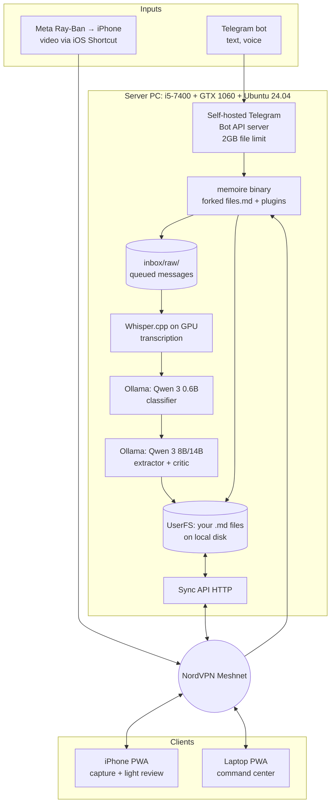

# Personal Smart Memoire — System Plan

> A private, local-first thought-capture system built on a fork of `files.md`.
> Quality over speed. Privacy over convenience. Your first brain over the second one.

---

## Philosophy

Quality is the **single** optimization target. This is not a product for users — it is a personal instrument. The implications are concrete:

- **Latency is irrelevant; correctness is everything.** We will choose the larger model, the second LLM pass, and the slower batch over the faster shortcut every time.
- **Privacy is non-negotiable.** Nothing leaves your hardware in v1. Claude API exists only as a quality safety net you opt into per-message.
- **The system serves your first brain.** It captures and pre-organizes. It never tries to think for you, summarize away the rough edges of your thinking, or become a substitute for actually re-reading and reflecting.
- **Auditability is a feature.** Every AI-touched item carries a marker comment. One `grep` shows you everything the LLM wrote. Trust through transparency.

---

## Architecture overview



---

## Decisions log

Every load-bearing decision settled during exploration, with the one-line rationale.

| # | Decision | Rationale |
|---|---|---|
| 1 | Fork `files.md`, extend Go bot via `Plugin` interface | Native, single binary, no orchestration layer |
| 2 | Host on extra PC (i5-7400, GTX 1060, 16 GB RAM, 128 GB SSD + 1 TB HDD) | Owned, capable, GPU enables local Whisper + LLM |
| 3 | Ubuntu Server 24.04 LTS | Headless, low overhead, NVIDIA drivers, familiar |
| 4 | Local storage only, no Google Drive | Privacy, simplicity, sovereignty |
| 5 | Whisper on GPU (`whisper.cpp` or `faster-whisper`) | Local, zero per-use cost, CUDA on 1060 |
| 6 | Local LLM via Ollama, Claude API as escape hatch | Privacy-first with quality safety net |
| 7 | LLM extracts structured pieces, routes to target files | Maximum organizational value per message |
| 8 | Auto-save silently, review later in PWA via `Review.md` | Dump-and-walk-away ergonomics |
| 9 | iPhone "Glasses" album + iOS Shortcut auto-forward | Hands-off pipeline from Meta Ray-Ban to server |
| 10 | NordVPN Meshnet for iPhone ↔ server reachability | Already subscribed, WireGuard, free, no public exposure |
| 11 | Self-hosted Telegram Bot API server | Lifts the 20 MB file limit to 2 GB |
| 12 | Multi-pass LLM with critic step + batch processing | Quality wins matter; latency is fine |

---

## System components

### `files.md` core (forked, mostly untouched)

- **Web PWA** — review and editing surface
- **Sync API** — bidirectional `.md` sync between server and devices
- **Existing Telegram bot** — text + image handling (kept as-is, we extend not replace)
- **Per-user filesystem** — source of truth on disk

### New components we build

**Bot extensions** — new Go code, mounted via the existing `Plugin` interface so we never fork the core flow:

| File | Job |
|---|---|
| `plugins/voice.go` | Receive voice messages, store raw audio in `media/`, queue for transcription |
| `plugins/video.go` | Receive video, store in `media/`, extract audio, queue, link from extracted items |
| `plugins/extractor.go` | Orchestrate the LLM pipeline, write to `Review.md` |

**Processing pipeline** — runs as a background goroutine, separate from the request path:

| File | Job |
|---|---|
| `pipeline/transcribe.go` | Call Whisper.cpp; return text + timestamps |
| `pipeline/classify.go` | Call Qwen 3 0.6B; tag category + confidence |
| `pipeline/extract.go` | Call Qwen 3 8B/14B; produce extraction JSON |
| `pipeline/critic.go` | Second pass; critique and refine the first JSON |
| `pipeline/route.go` | Write items to target files with AI marker comments |
| `pipeline/prompts.yaml` | All prompts (hot-reloadable, no recompile) |

**Review system:**
- `review.go` — appends each extracted item as a checklist line to `Review.md`
- Leans on files.md's existing checklist auto-prune behaviour (completed items are removed automatically)

**Deploy tooling:**
- `Makefile` with `build`, `deploy`, `deploy-rollback`, `logs`, `restart`
- `systemd` unit for the binary
- `.env.example` for secrets

### External services (on server, alongside the binary)

| Service | Port | Job |
|---|---|---|
| Ollama | 11434 | Serves Qwen 3 0.6B + 8B/14B |
| Whisper.cpp server | local exec | Transcription on GPU |
| Telegram Bot API server (self-hosted) | 8081 | Handles files up to 2 GB |
| `memoire` binary | 8080 | Bot + sync API |

---

## Data flow: voice note → memoire

```
1. You send a voice note to the Telegram bot
   (or a video lands in your iPhone "Glasses" album → iOS Shortcut POSTs to the server via Meshnet)

2. Bot receives the message:
   - Raw audio/video stored in media/<timestamp>.<ext>
   - Queue entry written to inbox/raw/<timestamp>.json

3. Background worker picks up the queue entry:
   a. Whisper transcribes audio → text + timestamps
      Raw transcript saved to media/transcripts/<timestamp>.txt (preserved forever)
   b. Tiny classifier (Qwen 3 0.6B) tags category + confidence
   c. Big extractor (Qwen 3 8B/14B) produces JSON:
        [
          { "type": "task",    "text": "Order brake pads for Volvo",  "target": "Later.md" },
          { "type": "idea",    "text": "Glass-ai scout-mode trigger", "target": "brain/Glass-ai scout-mode trigger.md" },
          { "type": "journal", "text": "Felt focused after gym",      "target": "journal/2026.05 May.md" }
        ]
   d. Critic pass: same model asked to find what was missed, misclassified, or splittable
   e. Router writes each final item to its target file, each tagged with an AI marker

4. Each item also gets a checklist line in Review.md:
     - [ ] Idea about glass-ai scout-mode trigger → [brain/Glass-ai scout-mode trigger.md]

5. Bot reacts with 👌 in Telegram (silent confirmation, no buttons)

6. Later, at the laptop: you open Review.md, click links, edit/move/delete,
   tick the box. Empty Review.md = inbox zero.
```

---

## File structure

### Server-side repo (your fork)

```
memoire/
├── cmd/
│   └── server/                # files.md original entrypoint
├── server/
│   ├── bot.go                 # files.md original
│   ├── sync/                  # files.md original
│   ├── plugins/
│   │   ├── voice.go           # NEW
│   │   ├── video.go           # NEW
│   │   └── extractor.go       # NEW
│   ├── pipeline/
│   │   ├── transcribe.go      # NEW
│   │   ├── classify.go        # NEW
│   │   ├── extract.go         # NEW
│   │   ├── critic.go          # NEW
│   │   ├── route.go           # NEW
│   │   └── prompts.yaml       # NEW (hot-reloadable)
│   └── llm/
│       ├── interface.go       # NEW: LLM abstraction (Ollama or Claude)
│       ├── ollama.go          # NEW
│       └── claude.go          # NEW (escape hatch)
├── deploy/
│   ├── Makefile
│   ├── memoire.service
│   └── deploy.sh
└── .env.example
```

### Your data (on server, syncs to devices)

```
~/memoire-data/
├── Chat.md                     # files.md default text dump
├── Review.md                   # NEW: AI-extracted items awaiting review
├── Later.md                    # tasks
├── Read.md / Watch.md / Shop.md
├── brain/                      # ideas, one per file
├── journal/
│   └── 2026.05 May.md
├── habits/
├── media/
│   ├── glasses_2026-05-21_1823.mp4
│   ├── voice_msg-abc.ogg
│   └── transcripts/
│       └── 2026-05-21_1823.txt
├── training/
│   └── corrections.jsonl       # NEW: passive fine-tuning corpus
├── archive/
└── config.json
```

---

## LLM strategy

### Model selection

| Role | Model | Size on disk | Why |
|---|---|---|---|
| Classifier | Qwen 3 0.6B | ~400 MB | Fast triage; loads in parallel with the big model |
| Extractor (default) | Qwen 3 8B-Instruct, Q4 | ~5 GB | Best multilingual (Arabic + English at near-native), strong structured output |
| Extractor (stretch) | Qwen 3 14B, Q4 | ~9 GB | Use if 8B misses nuance in your real data |
| Critic | Same as extractor | — | One model, second prompt |
| Escape hatch | Claude Haiku via API | — | One config line away; ~$0.001/message |

**Why Qwen 3 over alternatives** — Phi-4 Mini reasons well per-parameter but is English-skewed (bad for your Arabic notes). Gemma 4 has native function calling but smaller variants underperform on multilingual. Llama 3.3 is a solid all-rounder but Qwen leads on Arabic specifically.

### Quality investments your patience unlocks

1. **Multi-pass extraction.** First pass extracts, critic asks "what's missed, misclassified, or splittable," final pass produces JSON. Doubles processing time. Meaningfully improves quality.

2. **Batch processing with cross-message context.** Instead of one-at-a-time, the day's messages run together every few hours (or on demand). The model sees themes across messages, deduplicates near-duplicates, links related ideas.

3. **Schema-enforced JSON output.** Ollama supports forced JSON mode; we use it. Bad JSON triggers up to 3 retries with the parse error fed back into the prompt. Failure is observed and logged, never silent.

4. **Per-category prompts.** The classifier picks a category, then a category-specific prompt runs ("you are extracting tasks: produce action items with verbs and contexts"). Sharper output than one mega-prompt trying to be everything.

5. **Original transcript always preserved** under `media/transcripts/`. If an extraction was bad, re-run is one command — and you still have the raw audio.

### Long-term: fine-tuning on your corrections

Every time you edit, move, or delete an AI-extracted item in PWA review, the before/after is logged to `training/corrections.jsonl`. After roughly three months of real use, you'll have a corpus to fine-tune Qwen 3 3B (or whatever size) on **your** patterns, **your** vocabulary, **your** categories.

A fine-tuned 3B on your specific task can outperform a general-purpose 14B. This is where the quality ceiling really lifts.

### Language handling

No switch needed. Qwen 3 auto-detects per message and processes natively in the input language. Mid-thought English ↔ Arabic switching is fine. Output `.md` preserves your original phrasing — we never translate without an explicit ask. If you ever want forced-language output (e.g., always summarize in English regardless of input), that becomes a per-folder config.

---

## The laptop command center

Your laptop is the curation surface. Pattern:

1. Open `Review.md` in the files.md PWA, served from the laptop's local `web/index.html`, pointing at the server via Meshnet.
2. Each line is a checklist item linked to the file the LLM created or appended to:
   ```
   - [ ] Idea about glass-ai scout mode → [brain/Glass-ai scout mode.md]
   - [ ] Task: order brake pads → [Later.md]
   - [ ] Journal: felt focused after gym → [journal/2026.05 May.md]
   ```
3. Click each link → review what the LLM wrote → edit, move, or delete as needed.
4. Tick the checkbox when satisfied — files.md auto-prunes completed items.
5. Empty `Review.md` = inbox zero.

The AI marker comments (`<!-- ai:2026-05-21T18:23 src:msg-abc conf:0.92 -->`) are invisible in rendered Markdown but greppable on disk. One `grep -r "<!-- ai:" ~/memoire-data/` shows every item the LLM has ever touched.

Corrections that change category (e.g., the LLM put something in `brain/` that you decide is a task) get logged to `training/corrections.jsonl`. Free training data, captured passively.

You can also add notes yourself — type anywhere in any file. No AI marker means it's purely yours. The PWA sync pushes your edits back to the server, and the iPhone picks them up on its next connection.

---

## Deploy workflow

Standard, simple, recoverable.

**On the laptop (WSL2):**

```makefile
make build      # GOOS=linux GOARCH=amd64 go build -o memoire ./cmd/server
make deploy     # rsync binary + prompts.yaml to server, restart systemd unit
make logs       # tail -f server logs over SSH
make rollback   # restore previous binary, restart
make prompts    # rsync only prompts.yaml + signal reload (no restart)
```

**On the server:** runs `memoire.service` under systemd. Restart is sub-second. Previous binary kept as `memoire.prev` for one-command rollback. **Data and config are never touched by deploys.**

**Secrets** live in `/etc/memoire/.env` on the server only:

```env
TG_BOT_TOKEN=...
TG_BOT_API_URL=http://localhost:8081     # self-hosted Bot API server
OLLAMA_HOST=http://localhost:11434
WHISPER_PATH=/usr/local/bin/whisper-cli
CLAUDE_API_KEY=...                       # only used if LLM falls back to Claude
```

---

## Build phases

### Phase 0 — Foundation (you, before any code, ~1 evening)

- Install Ubuntu Server 24.04 on the spare PC
- Install NVIDIA drivers + CUDA 12.x
- Install Ollama, `ollama pull qwen3:8b` and `qwen3:0.6b`
- Install Whisper.cpp with CUDA support
- Install NordVPN, enable Meshnet, link the PC and your iPhone
- Self-host Telegram Bot API server (Docker image available)
- **Verify every piece with `curl`/CLI before any application code touches them**

### Phase 1 — Fork and run vanilla (Claude Code, ~half day)

- Fork `files.md`, clone to laptop
- Build, deploy to server, get vanilla `files.md` running under systemd
- Configure your Telegram bot, send a text message, confirm it lands in `Chat.md`
- Verify PWA sync from iPhone via Meshnet
- This establishes the baseline before we add anything

### Phase 2 — Voice pipeline (Claude Code, ~1–2 days)

- Add `voicePlugin` to intercept voice messages
- Wire up Whisper.cpp transcription
- Wire up Ollama (no extraction yet — just dump transcript to `Chat.md`)
- Validate transcription quality on real voice notes

### Phase 3 — LLM extraction (Claude Code, ~2–3 days)

- Add classify → extract → critic → route pipeline
- Implement `Review.md` checklist generation
- Implement AI marker comments
- Implement transcript preservation
- Validate on a week of real messages, tune prompts
- This is where quality actually emerges — expect prompt iteration

### Phase 4 — Video pipeline (Claude Code, ~1–2 days)

- iOS Shortcut: watch the Glasses album, POST new videos to the server via Meshnet
- `videoPlugin` accepts uploads, extracts audio, runs same pipeline as voice
- Video kept in `media/`, linked from extracted items by filename reference

### Phase 5 — Quality investments (ongoing)

- Multi-pass refinement on low-confidence items
- Batch processing every few hours
- Correction logging surface in PWA
- Fine-tuning kicks off when corpus is large enough (~3 months in)

---

## Open items folded into the plan

- **n8n** — no role in v1. Go handles everything inline. Revisit if we ever want visual workflow editing or cross-system integrations (Notion, calendar, web hooks); n8n could sit alongside without touching the core pipeline.
- **Backups** — server-side cron rsyncs `~/memoire-data/` to the 1 TB external HDD nightly, plus a weekly tarball. Optional later: encrypted offsite backup (encrypted Hetzner Storage Box or similar).
- **Multi-user** — explicitly out of scope. This is for you.
- **Mobile editing UX** — rely on the existing files.md PWA on iPhone. If review-on-the-go becomes painful, revisit then.
- **Glasses live streaming via Meta DAT SDK** — separate project (your other research thread). When that pipeline is ready, it can POST audio chunks to the same `/voice` webhook this plan defines, and everything downstream just works.

---

## Glossary

| Term | Meaning |
|---|---|
| **Review.md** | Single file listing every AI-extracted item as a checklist; your daily/weekly inbox |
| **AI marker** | HTML comment like `<!-- ai:2026-05-21T18:23 src:msg-abc conf:0.92 -->` attached to anything the LLM wrote; invisible in render, greppable on disk |
| **Glasses album** | Dedicated iPhone Photos album where the Meta AI app auto-saves Ray-Ban recordings |
| **Meshnet** | NordVPN's WireGuard-based P2P mesh; how the iPhone and the server reach each other from anywhere |
| **Plugin interface** | `files.md`'s existing extension point (`Plugin.CanHandle` / `Plugin.Handle`); how we add features without forking the core flow |
| **Correction log** | `training/corrections.jsonl`, every PWA edit to AI-extracted content; becomes fine-tuning data later |
| **Critic pass** | Second LLM call that critiques the first extraction's output before final JSON |

---

*This document is the spec. Hand it to Claude Code together with the `files.md` repo and it has enough to start Phase 1.*
